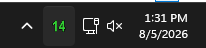
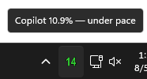
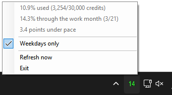

# copilot-quota-tray

A lightweight Windows system tray app that shows how far through the month you should be with your GitHub Copilot quota.

The tray displays a single number representing the expected percentage of the month completed. Its color shows whether your actual Copilot usage is under, near, or over that pace.

## Screenshots

### Default appearance



### Hover tooltip



### Right-click menu



## How it works

The displayed number is the expected quota usage percentage for the current point in the month.

By default, progress is calculated using Monday through Friday only. You can toggle **Weekdays only** from the tray menu to use every calendar day instead.

The number color indicates your current Copilot usage:

- **Green** — usage is more than 3 percentage points below pace
- **Yellow** — usage is within 3 percentage points of pace
- **Red** — usage is more than 3 percentage points above pace

For example:

```text
Displayed number: 14
Actual Copilot usage: 10.9%
Expected pace: 14.3%
Color: green
```

## Tray menu

Right-click the tray icon to see:

```text
10.9% used (3,254/30,000 credits)
14.3% through the work month (3/21)
3.4 points under pace

✓ Weekdays only

Refresh now
Exit
```

The app refreshes Copilot usage every five minutes.

## Requirements

- Windows
- .NET 9 runtime or SDK
- GitHub CLI (`gh`)
- An authenticated GitHub CLI session with access to Copilot usage data

Confirm authentication with:

```powershell
gh auth status
```

Confirm the Copilot quota endpoint works with:

```powershell
gh api /copilot_internal/user --jq '.quota_snapshots.premium_interactions'
```

## Build

From the project directory:

```powershell
.\build.ps1
```

The compiled app will be written to:

```text
publish\WorkdayProgress.exe
```

Run it with:

```powershell
.\publish\WorkdayProgress.exe
```

## Start automatically with Windows

1. Press `Win+R`.
2. Enter `shell:startup`.
3. Create a shortcut to `WorkdayProgress.exe` in that folder.

Windows may initially place the icon in the hidden tray overflow menu.

## Settings

The **Weekdays only** option is enabled by default.

When enabled:

- Monday through Friday count toward monthly progress.
- Saturdays and Sundays are ignored.
- Holidays are not excluded.

When disabled:

- Every calendar day counts.

The selected setting is saved to:

```text
%LocalAppData%\CopilotPace\settings.json
```

## GitHub CLI path

The app checks common GitHub CLI installation locations and then falls back to `PATH`.

You can override the executable location with:

```powershell
setx GH_PATH "C:\path\to\gh.exe"
```

Restart the app after changing the environment variable.

## Failure behavior

If GitHub CLI is unavailable, unauthenticated, or the request fails:

- The app keeps the last successfully displayed value.
- On first launch, it initially shows a gray `0`.
- The tray menu displays the refresh error.
- The app retries automatically every five minutes.

## Important limitation

This project uses the undocumented GitHub endpoint:

```text
/copilot_internal/user
```

Because it is internal, GitHub may change or remove it without notice.
